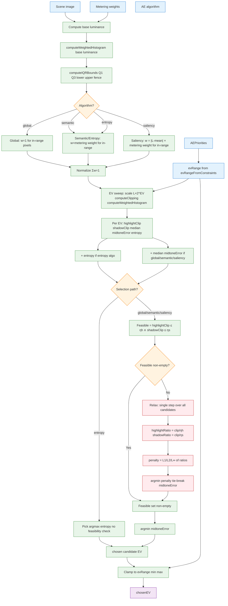
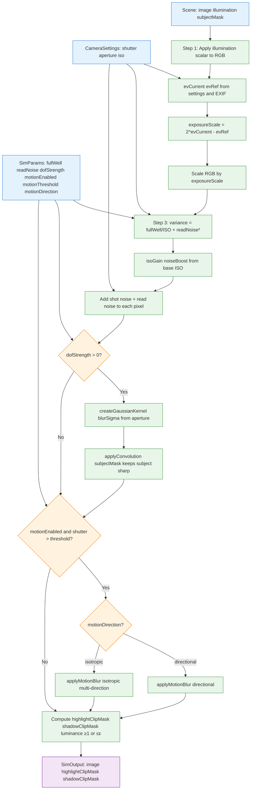

# AE & Allocation Flowchart

Three flowcharts, no subgraphs. AE → Allocation → simulateForward.

**AE (EV selection)**

**Allocation**

**simulateForward**

---

## Key symbols

| Symbol | Meaning |
|--------|---------|
| in-range | Pixels within 1.5×IQR fence: Q1−1.5·IQR ≤ L ≤ Q3+1.5·IQR |
| ηh | max allowed highlight clipping fraction |
| ηs | max allowed shadow clipping fraction |
| penalty | L1, L2, or L∞ norm of (highlightRatio, shadowRatio) when relaxing |

---

## Files

- **AE (EV):** `src/ae/runLexiAE.ts`
- **Allocation:** `src/allocation/allocateSettings.ts`
- **simulateForward:** `src/sim/simulateForward.ts`
- **Pipeline:** `src/pages/Lab.tsx`
